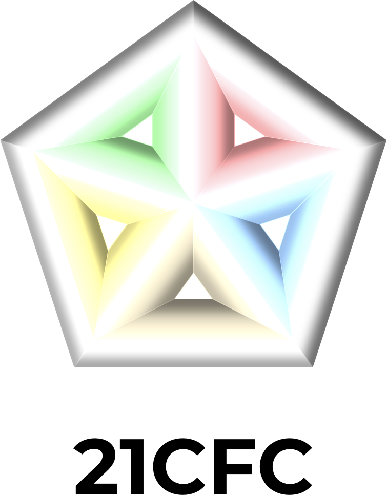
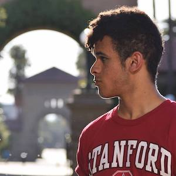
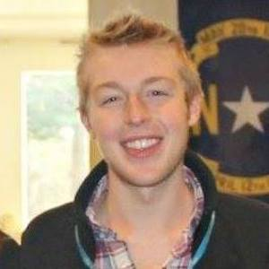
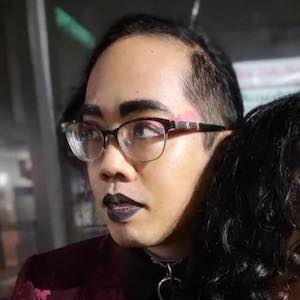
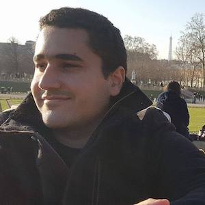
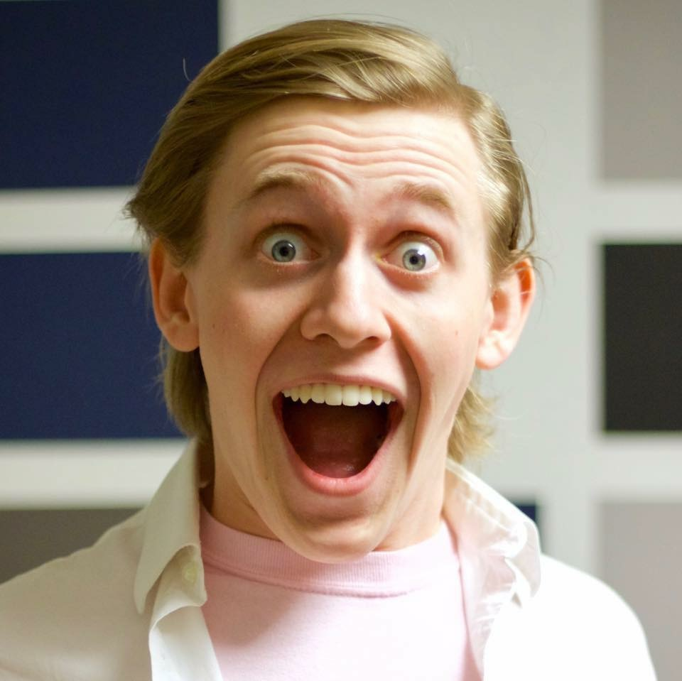

Team 20, better known as **21CFC**, is the hottest new team to come out of Stanford University since Simon & Garfunkel. And just as Simon & Garfunkel perfected the airplane during their extraordinary expeditions to the stars, **21CFC** will achieve greatness this quarter. Just you wait. You'll see.

# Our Team

|||||
|-|-|-|-|-|
|**Cade** is an honest octopus!|**Hayden** is a tired flamingo!|**Oliver** is a tall spider!|**Reinaldo** is an eager tiger!|**Toby** is a dead canary!|

## Our Skills

|Member|Technical Skills|Personal Traits|Desired Growth|Weaknesses|
|------|----------------|---------------|--------------|----------|
|Toby|Embedded systems, web, 2d & 3d graphics, visual design (color theory woop woop!), music, aerospace, machine learning, teaching, physics, languages: C++, C, Java, JavaScript (React, Angular, three.js, TensorFlow, and more!), Objective-C, Swift (and all that comes with iOS dev), OpenGL, Metal|I like learning new things in depth. I'm good at focusing deeply on one thing. I easily get attached to my work and like doing a good job at it.|Learn something new about something new.|Sometimes I miss the forest for the trees.|
|Hayden|Mobile dev, web dev, Python, databases, API design|Fun, disciplined|Writing documentation, graphics/art|Design (colors/font)|
|Oliver|HCI, Python, C, web dev|Enjoys thinking about practical application, work experience in industry with teams using tools used in industry, tends to desire creating or imagining things that could improve lives or society in a real sense rather than just academic curiosity.|Project management, technical skills, documentation, have a project I can show or talk about to recruiters.|Tends to overthink, more rusty on technical skills because of breaks in between quarters to work. Commuting from Oakland rather than staying on-campus, but will certainly be here for all scheduled meetings and willing to work a lot on this remotely as this is one of two classes left to graduate.|
|Cade|Machine learning, full stack development, mobile development|Persistent, creative, contemplative, thorough|Visual design, writing documentation|Overthinking things, perfectionism|
|Rei||||

# Our Project

We will be creating a macOS app that uses optical character recognition (OCR) to allow the user to easily select and copy to the clipboard *any* visible text on the user's screen, whether that text is in a picture, a video, or "real" selectable text. The app will be activated by a global keyboard shortcut (like taking a screenshot) and will temporarily put the user's screen into a text-selection mode until they copy something to the clipboard or press <kbd>Esc</kbd>.
